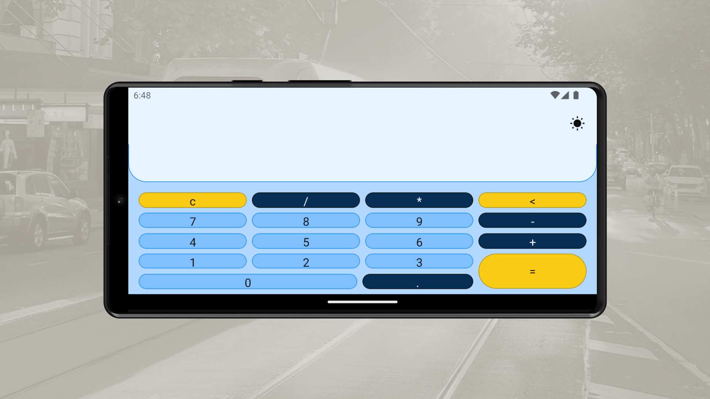

<h1 align="center">
Calculator App With Dart, Flutter, Material 3, Shared Preferences, Bloc, Testing Library, Get It, Futures

</h1>

 

 

  <a href="#description">✍️ Description</a> &nbsp;&nbsp;&nbsp;|&nbsp;&nbsp;&nbsp <a href="#technologies">🚀 Technologies</a> &nbsp;&nbsp;&nbsp;|&nbsp;&nbsp;&nbsp <a href="#related">♟️ Related</a> &nbsp;&nbsp;&nbsp;|&nbsp;&nbsp;&nbsp <a href="#contact">✉️ Contact</a>

 
 

<h3 id="description">✍️ Description:</h3>

Working with Flutter to me is always a pleasure, all the library api are handy and easy to use; it is fast to create any kind of application with these tools. Creating a simple calculator app with a hexagonal approach, as this one, provides the glue of your idea and a robust, maintainable and reliable software and, being fair, dart reminds me of developing on javascript but with my beloved object-orienting fashion. Lovely!

 

<h3 id="technologies">🚀 Technologies:</h3>

To build this project is used:

- Dart
- Flutter
- Flutter Testing Library
- Eval Ex
- Shared Preferences
- Bloc
- Get It
- Material 3 (Material You)

 

<h3 id="related">♟️ Related:</h3>

See more:

<ul>
  <li><a href="https://github.com/samueldecarvalhodeveloper/Calculator-App-With-Jetpack-Compose-Kotlin-Material-3-JUnit-Mockk-Dagger-2-Coroutines-Ui-Automator">Calculator App With Jetpack Compose</a></li>
  <li><a href="https://github.com/samueldecarvalhodeveloper/Calculator-App-With-React-Native-Expo-Custom-Hooks-Typescript-Async-Storage-Prettier-Eslint">Calculator App With React Native</a></li>
  <li><a href="https://github.com/samueldecarvalhodeveloper/Pokedex-API-With-Elixir-PHP-Python-Laravel-Phoenix-FastAPI-Uvicorn-Asyncio-Unittest-PHP-Unit-Docker">Pokedex Api With Laravel</a></li>
</ul>

 

<h3 id="contact">✉️ Contact:</h3>

**Email:**
<a href="mailto:personal.samuelcarvalho@gmail.com">personal.samuelcarvalho@gmail.com</a>

 
 

<strong>Repository Link:</strong>

[https://github.com/samueldecarvalhodeveloper/Calculator-App-With-Dart-Flutter-Material-3-Shared-Preferences-Bloc-Testing-Library-Get-It-Futures](https://github.com/samueldecarvalhodeveloper/Calculator-App-With-Dart-Flutter-Material-3-Shared-Preferences-Bloc-Testing-Library-Get-It-Futures)
